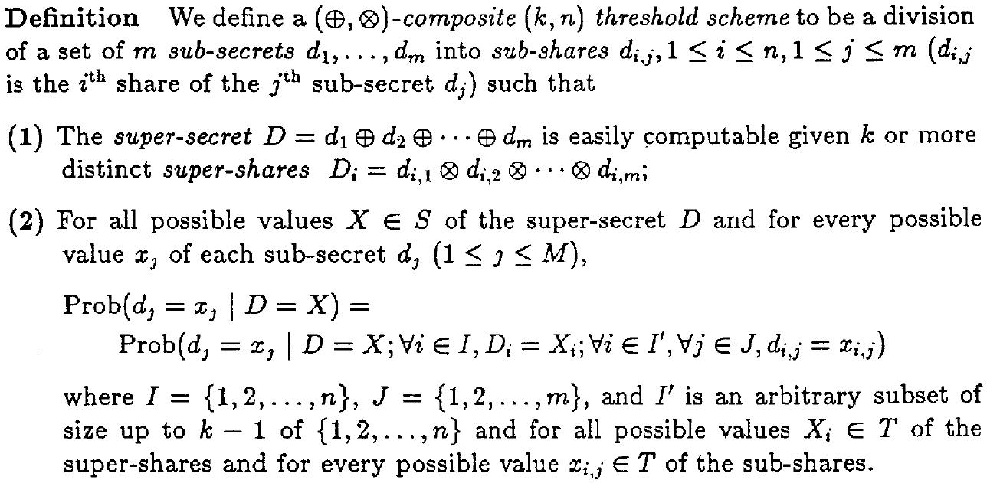

<head>
    
    
</head>

[**pdf_source**](https://link.springer.com/chapter/10.1007/3-540-47721-7_19)

# Secret Sharing Homomorphisms Keeping Shares of a Secret Secret
## Introduction

文章[[Benaloh86]](#Benaloh86)介绍了Shamir门限方案的同态性质，提出了 $k$ -一致性的概念，进而提出了组合门限方案，并给出了应用：可验证秘密共享和电子投票。

## The Homomorphism Property
&emsp;&emsp;Shamir in [[SHA79]](#sha79) defines a $(k,n)$ *threshold scheme* to be a division of a secret $D$ into $n$ pieces $D_1, \cdots,D_n$, in such a way that:
>1. knowledge of any $k$ or more $D_i$ pieces makes $D$ easily computable;
>2. knowledge of any $k-1$ or fewer $D_i$ pieces leaves $D$ completely undetermined (in the sense that all its possible values are equally likely).

&emsp;&emsp;Shamir门限方案有两个条件，一是等于或多于$k$方的情况，一是少于$k$人的情况，满足同态性质，定义如下：

&emsp;&emsp;需要注意的是，原始的Sharmir门限方案只满足 $(+,+)$ 同态。原因是 $d$ 个 $t-1$ 次多项式相加，仍是 $t-1$ 次，而 $d$ 个 $t-1$ 次多项式相乘，结果为 $d(t-1)$ 次。根据拉格朗日插值定理，至少需要 $d(t-1)+1$ 个份额才能恢复出秘密，可能会出现 $d(t-1)+1>n$ ，即拥有所有份额都无法恢复秘密的情况。
> BGW协议[[BGW88]](#BGW88)中的加法运算，就是利用Shamir门限方案的加法同态实现秘密值和的安全多方计算。

&emsp;&emsp;但是通过离散对数，可以将其构造成 $(\times,+)$-*composite threshold scheme*. By using a homomorphism between addition and discrete logarithms, for example, it is possible to transform Shamir’s scheme into a $(\times,+)$-*composite (k,n) threshold scheme*.即：***The sum of the shares of the discrete logs of the secrets are shares of the discrete log of the product of the secrets.***
> $$f(x)=\log_as+\sum_{i=1}^{t-1}a_ix_i\ ; \\
> f'(x)=\log_as'+\sum_{i=1}^{t-1}a_i'x_i\ ; \\
> f(x)+f'(x)=\log_a{s\cdot s'}+\sum_{i=1}^{t-1}(a_i+a_i')x_i$$

文章所提思路中，为了降低计算复杂度，选取了较小的模数 $p$，也就限制了共享秘密的乘积必须小于模数 $p$。文献[[史明杰2016]](#shi2016)中采用了易计算离散对数设计实现了乘法同态性。
<!-- 

 -->

## Composite threshold scheme
### Definition

<!--  -->

&emsp;&emsp;组合门限方案的概念对Shamir门限方案的定义进行了修改。
- 给定至少 $k$ 个super-shares $D_i$，即可轻易重构super-secret $D$。其中，super-secret $D$ 可以由sub-secret $d_i$ 执行 $\oplus$ 操作得到，而super-shares $D_i$ 可以由 sub-shares $d_ij$ 执行 $\otimes$ 得到。这里运用了上文提到的 $(\times,+)$-composite threshold scheme思想。
>> **Note**：条件（1）中只提到从 $D_i$ 可以恢复出 $D$ ，并没有说明参与者是否需要sub-share $d_{ij}$ 的知识。 如果参与方只是拥有super-shares $D_i$，而不知道构成 $D_i$ 的 $d_{ij}$，那也可以说该定义中内涵着隐私保护的思想。
- 条件（2）类似Shamir方案中的条件（2），也是在定义少于 $k$ 个份额无法重构秘密，只不过这里的前提条件更为复杂。
- - $X$ 是可能的super-secret取值，$D=X$ 也即是给定super-secret取值空间；
- - $I=\{1,2,\cdots,n\}$代表参与人数，$D_i=X_i$ 表示给定super-shares的取值空间；
- - $I'$ 是维度为 $k-1$ 的 $I$ 子集，即 $k-1$ 个参与者，$d_{ij}=x_{ij}$ 表示给定sub-secret $d_j$ 的任意 $k-1$ 个sub-shares。（Note that: 每一个sub-secret $d_j$ 及构成它的sub-shares $d_{ij}$ 单独拎出来都是一个Shamir门限方案，因此，同样满足 $k-1$ 个份额无法恢复出秘密的性质。）
- 综上所述，在给定上述知识后，敌手猜测 $d_j=x_j$ 的概率和只给定秘密取值空间时的概率相等（即在给定super-secret $D$，super-shares $D_i$ 以及 $k-1$ 个sub-shares $d_{i,j}$ 时，敌手无法获得额外知识）。

\

> **Theorem 1** If the secret domain $S$ and the share domain $T$ are finite and of the same cardinality, then every $(\oplus,\otimes)$-homomorphic $(k,n)$ threshold scheme is a $(\oplus,\otimes)$ -composite $(k,n)$ threshold scheme.

&emsp;&emsp;文中给出了证明的sketch，基本思路是，给定一个秘密域为 $S$ 份额域为 $T$ 的同态门限方案，证明其满足上述定义的条件(1)和条件(2)。

>  **Remark** The condition that the secret domain $S$ and the share domain $T$ are of the same finite cardinality was not strictly required, and the following weaker property will suffice.

&emsp;&emsp;也就是说，秘密域和份额域有限且基数相等并不是必要条件。对于指定的 $D_k$ 和sub-secret $d_1,d_2,d_1',d_2'$，s.t. $d_1\oplus d_2=D=d_1'\oplus d_2'$，令 $p:=(D_k=d_{1,k}\otimes d_{2,k})$，$p':=(D_k=d_{1,k}'\otimes d_{2,k}')$，只要找到满足 $p=p'$ 的 $d_1,d_2,d_1',d_2',D_k$ 即可（证明过程太复杂，所以作者就只写了简单的条件）。
<!-- 

 -->

## Verifiable Secret Sharing
&emsp;可验证的秘密共享的问题是要说服份额持有者，他们的份额（集体）是 $k$ **一致**（ $k$**-consistent**）的，即任意 $k\in n$ 个份额都能恢复出同一个secret。
> **Definition** We say that a set of $n$ shares $s_1,s_2,\cdots, s_n$ is $k$-consistent if every subset of $k$ of the $n$ shares defines the same secret.

&emsp;**Note that:** Shamir's scheme, the shares $s_1,s_2,\cdots,s_n$ are $k$ - *consistent* **if and only if** the interpolation of the points $(1,s_l),(2,s_2),\cdots,(n,s_n)$ yields a polynomial of degree at most $d = k - 1$. It is also useful to observe that if the sum of two polynomials is of degree at most $d$, then either both are of degree at most $d$ or both are of degree greater than $d$.

## VSS思路

图中主要思路是一种交互式的协议，prover加密了 $n$ 个（假设100个）多项式发送给verifier，verifier从中**随机选择**50个验证多项式的度（假设这些多项式的度都至多为 $d$，那有理由相信剩下的50个多项式的度也为 $d$）。思路用了 $k$ 一致性的定义，即由 $n$ 个不同点处的值给出的多项式 $P$ 的degree至多为 $d$，则表示是同一个秘密所生成的多项式，自然也就恢复出同一个秘密。

## Reference
<!-- 这边文章是介绍如何在 Markdown 中增加文献引用。[1](#refer-anchor-1) -->

- [Benaloh86] [Benaloh, Josh Cohen. "Secret sharing homomorphisms: Keeping shares of a secret secret." Conference on the theory and application of cryptographic techniques. Berlin, Heidelberg: Springer Berlin Heidelberg, 1986.](https://link.springer.com/chapter/10.1007/3-540-47721-7_19)

- [SHA79] [Shamir, Adi. "How to share a secret." Communications of the ACM 22.11 (1979): 612-613.](https://dl.acm.org/doi/abs/10.1145/359168.359176)

- [史明杰2016] [史明杰. Shamir秘密共享方案的同态性及其应用研究[D].云南大学,2016.](https://kns.cnki.net/kcms2/article/abstract?v=3uoqIhG8C475KOm_zrgu4lQARvep2SAkkyu7xrzFWukWIylgpWWcEjOv9-dzfNexjdXokhB6o9Vbo_ZZikkOzfPD1dHmUH6I&uniplatform=NZKPT)

- [BGW88] [Ben-Or, Michael, Shafi Goldwasser, and Avi Wigderson. "Completeness theorems for non-cryptographic fault-tolerant distributed computation." Providing sound foundations for cryptography: on the work of Shafi Goldwasser and Silvio Micali. 2019. 351-371.
](https://dl.acm.org/doi/abs/10.1145/3335741.3335756)

